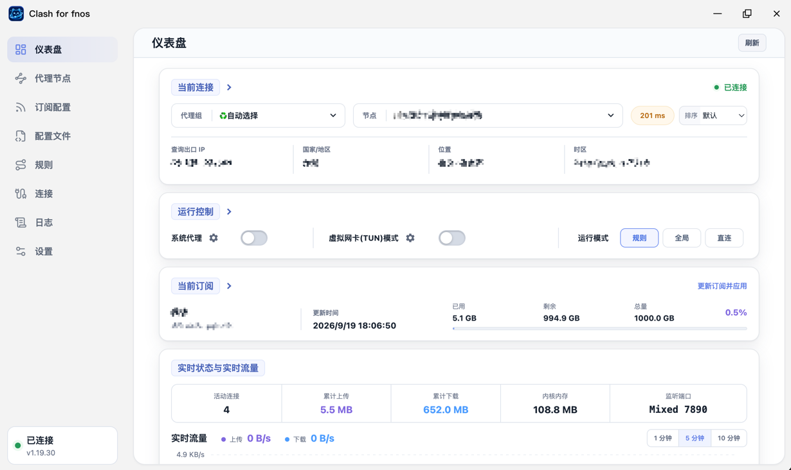

<div align="center">


# Clash for fnos

简体中文 | [English](README.en.md)

**运行在 fnOS 上的原生 Mihomo / Clash 管理器**

通过 fnOS 桌面直接管理 Mihomo Core、代理节点、订阅配置、规则、连接、日志、TUN 与系统代理环境变量。

[](https://github.com/chenpingonline/Clash-for-fnos/releases)
[](https://github.com/chenpingonline/Clash-for-fnos/releases)

[](https://github.com/MetaCubeX/mihomo)
[](LICENSE)

[操作手册](docs/user-guide.md) · [下载 Releases](https://github.com/chenpingonline/Clash-for-fnos/releases) · [问题反馈](https://github.com/chenpingonline/Clash-for-fnos/issues) · [Mihomo](https://github.com/MetaCubeX/mihomo) · [Clash-Manager](https://github.com/chenpingonline/Clash-Manager)

</div>

---



界面截图仅作示例，功能与入口以当前版本为准。

## 项目简介

Clash for fnos 是为 **飞牛 fnOS** 设计的 Mihomo 管理应用，目标是在 NAS 上提供一个无需频繁 SSH、无需手工修改 YAML 的图形化管理入口。

本仓库负责 fnOS 原生 FPK、宿主集成与发布；公共前端、后端、多语言、Linux 安装包与 Docker 在 Clash-Manager 维护。构建固定版本的公共源码，不需要在两个仓库重复开发业务功能。

后端已完整迁移为 Go：普通用户权限的 Web 服务负责界面、API 和 Mihomo Controller 通信，独立的 Go Root Helper 仅通过白名单 Unix Socket 执行必要的系统操作。

应用支持两种 Core 工作模式，并提供离线架构包与在线通用包：

- **Manager 托管模式**：首次启动默认启用；架构专用包使用内置 Core，`all` 通用包按运行平台从官方 Release 下载 Core。两种方式都会校验 SHA-256 后启用。
- **External 模式**：需要使用本机已有 Mihomo 时，在“设置 → Mihomo Core 设置 → 内核管理 → Core 运行方式”切换。选择会保存并在重启后沿用；升级保留已有的托管或外部模式。托管模式只检查实际端口冲突，不会自动停止外部 Mihomo。

> [!IMPORTANT]
> Clash for fnos 是 Mihomo 的管理工具，**不提供代理节点、订阅服务或任何网络线路**。请自行准备合法可用的 Mihomo 配置或订阅。

---

## 界面语言

支持 **简体中文 / English / 跟随系统**。在设置页右上角的「界面语言」中可即时切换，选择保存在当前浏览器中；跟随系统按浏览器语言选择，中文使用简体中文，其余使用英文。节点名、订阅名、YAML、地址、路径和原始日志保持原样，日期按所选界面语言显示。fnOS 与 Docker 共用语言包。翻译维护说明见 [多语言指南](docs/i18n.md)。

## 功能

| 模块 | 功能 |
| --- | --- |
| 仪表盘 | 查看 Mihomo 状态、出口位置、持久流量累计、10 分钟实时流量、内存、当前端口、LAN、IPv6 与 TUN 等运行信息 |
| 代理节点 | 查看代理组与节点、切换节点、延迟测试、保存代理组选择 |
| 订阅配置 | 添加远程订阅、导入本地 YAML、更新与应用配置、自动更新与自动应用；按订阅可视化编辑规则、节点、代理组，支持订阅与全局覆写配置、扩展脚本 |
| 配置文件 | 查看当前配置、编辑托管 YAML、校验并保存到启动配置，应用失败自动恢复 |
| 规则 | 查看规则、按订阅保存并恢复规则的启用／禁用状态、查看规则来源说明，支持单独或批量更新规则集 |
| 连接 | 查看当前活动连接、上传/下载统计，支持关闭单个连接或全部连接 |
| 日志 | 实时查看 Mihomo 日志、按行数和日志级别筛选、搜索高亮、切换自动换行、查看历史日志与清空日志 |
| 网络设置 | 管理 Mixed / HTTP / SOCKS / Redir / TProxy 端口、Allow LAN、IPv6 等参数 |
| DNS 与解析 | 分类管理 Mihomo DNS、解析服务器、Fake IP、域名策略、回退过滤与 Hosts 映射；修改后自动备份、校验并应用，失败自动回滚 |
| TUN | 管理 TUN 快速开关、Stack、MTU、自动路由、DNS 劫持、严格路由及排除网段，并提供校验、回滚与升级恢复 |
| 环境变量 | 管理 `/etc/environment`、`/etc/profile`、`/etc/bash.bashrc` 中的代理环境变量 |
| Core 管理 | 自动检测本机 Mihomo、支持内置或按架构下载 Core、在线检查/更新、备份与失败回滚 |
| GEO 数据 | 安装包内置基础数据，设置页可查看并通过 Mihomo 更新 GeoIP、GeoSite、Country MMDB、ASN MMDB |
| 软件图标 | 支持多套 fnOS 桌面/窗口图标切换 |
| 应用更新 | 支持接入 GitHub Releases 进行版本检测，FPK 升级仍由 fnOS 应用中心负责 |

### 配置编辑与规则开关

- 「配置文件」默认以紧凑 YAML 预览，支持「格式化／压缩」切换、行号与语法高亮。压缩后的列表保持单行，横向滚动条常驻，编辑器的纵向滚动条也保持可见。超长行默认只显示开头与「展开更多（大小）」按钮，点击后展开，可再次收起；全文搜索会展开匹配所在行，仍可定位到行尾。「复制配置」与「编辑配置」使用实际配置原文。编辑器内可格式化或压缩草稿，支持撤销，点击「保存并应用」后才写入启动配置，收起的内容不会丢失。
- 在「配置文件」点击「编辑配置」可修改正在运行的 Manager 托管 Core 的启动 YAML。「保存并应用」会复用备份、Mihomo 校验、应用和失败回滚流程，并同步到启动配置。外部 Core 的配置保持只读。编辑期间如发生订阅更新、切换配置或其他配置修改，会拒绝覆盖，需保留草稿后重新读取并合并。
- 直接编辑的内容可能被后续订阅应用覆盖。需要长期保留的修改请使用「订阅配置 → 编辑 → 编辑规则／编辑节点／编辑代理组」或扩展覆写配置、扩展脚本。三个可视化编辑器使用顶部添加区和紧凑表格，支持来源筛选、前置、后置、排除与恢复原始条目，修改按订阅独立保存，更新订阅后仍会应用；高级模式可直接编辑增强 YAML。Controller 地址和 Secret 会保留当前连接设置。
- 「规则」每行的开关立即影响当前内核运行状态；状态自动保存，重新加载配置、应用订阅或重启内核后由后台恢复已保存的设置。按类型、内容和目标策略匹配，顺序变化不会误关其他规则；每个订阅独立保存并恢复自己的设置，规则内容或重复数量变化时跳过恢复。后台每 10 秒检查一次并重试恢复。旧内核不支持时开关不可用。禁用后继续匹配后续规则，关闭 `RULE-SET` 会跳过整个引用的规则集。
- 代理组与大量分流规则通常来自订阅返回的完整 YAML。软件默认不额外生成代理组或分流规则；订阅增强和全局增强可以修改最终配置。可对照原始订阅中的 `proxy-groups`、`rules`、`rule-providers` 查看来源，或打开规则页的「规则说明」。

### 订阅增强

在「订阅配置」中打开对应配置的「编辑」菜单：

- **编辑规则**：选择规则类型、内容和目标策略，添加前置或后置规则；支持搜索、编辑和排序新增规则，以及排除、恢复原始规则。
- **编辑节点**：支持按行粘贴节点 URI 或导入 Base64 编码的节点列表，添加前置或后置节点；支持按名称/类型搜索、来源筛选、排序新增节点，以及排除、恢复原始节点；自定义节点参数可从表格「编辑」进入高级 YAML。
- **编辑代理组**：设置组类型、名称、成员、代理集合及健康检查参数；支持添加、编辑和排序新增代理组，以及来源筛选、排除和恢复原始代理组；健康检查等可选参数位于「更多设置」。
- **扩展覆写配置 / 扩展脚本**：处理其他配置项或更复杂的修改。全局增强入口位于订阅配置页面，应用任一订阅配置时都会参与合并。

前三项默认使用可视化编辑，切换「高级」可编辑 `prepend`、`append`、`delete` 增强 YAML。点击「保存并应用」后保存增强并应用对应配置；「重置本订阅增强」只重置当前编辑器的草稿，需要保存后才会生效。远程订阅尚未下载时，先更新订阅以查看原始内容。

各编辑窗口标题旁的问号提供对应示例：规则、节点与代理组使用增强 YAML，覆写配置使用配置片段，扩展脚本使用 JavaScript。问号在高级模式中仍可打开。

最终配置按以下顺序生成：原始订阅 → 规则 / 节点 / 代理组增强 → 全局覆写 → 全局脚本 → 对应订阅覆写 → 对应订阅脚本 → 已保存的 Core 用户设置和启用的 DNS / Hosts 覆盖 → 校验并应用。覆写配置中的对象递归合并，数组整体替换；脚本使用 `main(config, profileName)` 并返回配置对象。增强文件与原始订阅分开保存，后续更新订阅仍会重新应用这些修改。

---

## Mihomo 工作模式

### Manager 托管模式

首次启动或在设置中选择托管模式时：

1. 检测当前 Linux CPU 架构。
2. 架构专用包选择内置 Core；`all` 通用包从官方 GitHub Release 选择对应资产。
3. 校验 Core 的文件大小和 SHA-256。
4. 将 Core 安装到 Clash for fnos 自己的数据目录。
5. 准备托管配置和 GEO 数据。
6. 启动 Mihomo，并自动读取 Controller、Secret、Mixed Port 等运行参数。

可在“设置 → Mihomo Core 设置 → 内核管理”启动、停止或重启托管 Core。手动停止保留管理页面和托管模式，可通过“启动内核”或首页“重新检测”恢复；下次启动应用时仍会自动启用托管 Core。外部 Core 的启停由原有服务管理。

架构专用包首次启用不依赖在线下载 Mihomo；`all` 通用包体积更小，但首次启用必须能访问 GitHub。

### External 模式

在“设置 → Mihomo Core 设置 → 内核管理 → Core 运行方式”选择外部 Mihomo 后：

- 不自动覆盖用户已有 Mihomo。
- 使用原有服务管理外部 Core 的启动与停止。
- 自动尝试识别 Mihomo 进程、配置文件、Controller 与 Secret。
- 继续提供节点、规则、连接、日志等可视化管理能力。

External 模式下，用户原有的 Mihomo 配置仍由用户自行维护；涉及系统配置写入的操作会尽量先备份再应用。

---

## 支持平台

| fnOS 设备架构 | Release 文件 | Core 获取方式 |
| --- | --- | --- |
| Intel / AMD x86_64 | `Clash for fnos_<version>_x86_64.fpk` | 内置 `linux/amd64` |
| ARM64 / aarch64 | `Clash for fnos_<version>_arm64.fpk` | 内置 `linux/arm64` |
| fnOS x86 / ARM 通用 | `Clash for fnos_<version>_all.fpk` | 不内置；运行时检测并下载 |

运行依赖：

- fnOS **1.1.3100 或更高版本**（应用入口使用统一网关）
- Go 后端已静态编译进 FPK，无需安装 Node.js 或其他运行时
- 管理员权限用于安装应用

自 v1.3.0 起，安装清单通过 `os_min_version=1.1.3100` 声明最低系统版本。较早的安装包未声明这一限制，也不代表支持 fnOS 1.1.26 等旧系统。

> [!TIP]
> 不确定设备架构时可以选择 `all` 通用包。已知是 `x86_64` 或 `aarch64` / `arm64` 且希望首次启动不依赖 GitHub 时，优先选择对应架构专用包。

---

## 安装

### 从 GitHub Releases 安装

1. 打开项目的 [Releases](https://github.com/chenpingonline/Clash-for-fnos/releases)。
2. 根据 NAS CPU 架构下载专用 `.fpk`，或下载不含 Core 的 `all` 通用包。
3. 进入 **fnOS → 应用中心 → 手动安装**。
4. 选择下载好的 FPK 并完成安装。
5. 从 fnOS 桌面打开 **Clash for fnos**。

升级已有版本时，可以直接使用 fnOS 的手动安装功能安装新版 FPK。

升级注意事项：

- 已有订阅、托管配置、备份和应用设置继续存放在 fnOS 应用配置/数据目录中。
- 在设置页面明确保存的端口、局域网访问、全局 IPv6、统一延迟、TUN 和 GEO 更新设置独立存放于配置目录的 `core-user-settings.json`。每次应用订阅（含自动更新并应用）时，先合并用户设置，再校验和应用；未修改的项目沿用订阅值。启用 DNS 覆盖时，同时应用已保存的 DNS/Hosts 设置。
- 从 v1.0.0 之前的旧版升级时，旧配置不会整体转换为用户偏好，因为旧版未记录修改来源。请重新保存需要跨订阅保留的设置；直接编辑 YAML 不会自动登记为用户偏好。
- 新版不再依赖 `nodejs_v22`，无需额外安装或保留 Node.js 运行环境。
- TUN 开启状态下升级会短暂释放并重建虚拟网卡及路由，这是预期行为。
- 建议升级完成后检查仪表盘的 Core、TUN 和出口连接状态。

### SHA-256 校验

本地构建会为每个 FPK 同时生成 `.sha256` 文件：

```text
Clash for fnos_<version>_x86_64.fpk
Clash for fnos_<version>_x86_64.fpk.sha256
Clash for fnos_<version>_arm64.fpk
Clash for fnos_<version>_arm64.fpk.sha256
Clash for fnos_<version>_all.fpk
Clash for fnos_<version>_all.fpk.sha256
```

Release 附件以实际发布内容为准。下载页同时提供对应 `.sha256` 时，可在同一目录下用以下命令校验：

```bash
sha256sum -c "Clash for fnos_<version>_x86_64.fpk.sha256"
```

---

## 项目结构

本仓库维护 fnOS 打包与宿主集成，公共业务源码通过 `upstream.lock` 固定到完整提交 SHA。

```text
Clash-for-fnos/
├── fpk/
│   ├── app/ui/                 # fnOS 桌面入口与图标
│   ├── cmd/                    # fnOS 生命周期脚本
│   ├── config/                 # privilege / resource 配置
│   ├── wizard/                 # 安装与卸载向导
│   ├── ICON.PNG
│   ├── ICON_256.PNG
│   └── manifest                # FPK 版本源
├── upstream.lock               # 公共仓库、VERSION 与完整 commit SHA
├── scripts/                    # 获取固定源码、检查、FPK 构建与审计
├── docs/                       # fnOS 文档与截图
├── CHANGELOG.md                # fnOS 更新记录
├── LICENSE
├── README.md
├── README.en.md
└── dist/                       # 最终安装包与校验文件，不提交
```

公共源码在 Clash-Manager 的 `backend/`、`web/` 中维护，Core 资产在 `resources/core/`，基础 GEO 数据在 `assets/geodata/`。构建时将锁定提交导出到临时目录，编译后装入 FPK。安装后的应用不从 GitHub 拉取程序源码。

---

## 从源码构建

### 构建环境

构建脚本使用 Bash，可在以下环境构建：

- Linux
- WSL2
- GitHub Actions Linux Runner
- macOS（需提供下列 GNU 兼容命令，系统默认不包含 `md5sum` 和 `sha256sum`）

需要以下基础命令：

```text
bash
git
python3
cp
tar
gzip
sed
awk
mktemp
md5sum
sha256sum
```

首次构建需要访问 GitHub 和 npm。构建机需要 Python **3.12 或更高版本**、Node.js **22.12 或更高版本**（仅用于 Vue 前端）、npm 和 Go **1.22 或更高版本**。构建出的 FPK 不依赖 Node.js。

### 统一版本号

FPK 应用版本只修改 `fpk/manifest` 中的 `version`（格式为 `主版本.次版本.补丁版本`），同时完成对应的 `CHANGELOG.md`。

- 公共源码的版本和提交由 `upstream.lock` 记录，与 FPK 版本独立。
- 构建将 manifest 版本和 fnOS 更新日志注入公共源码的临时导出目录，同步其中的 npm 版本，两个 Go 二进制通过链接参数读取 FPK 版本。
- 构建不修改 Clash-Manager 工作目录，也不将前端构建依赖打入 FPK。
- 包内 `build-info.json` 记录 FPK 版本、公共源码版本和完整 SHA，便于追溯。

打包脚本不会自动递增版本。每次生成新的可安装 FPK 前，先递增 manifest 补丁版本并更新日志；失败且未生成安装包的重试不需要再次递增。

### 开发检查

在本仓库运行：

```bash
./scripts/check.sh
```

检查涵盖生命周期脚本语法、固定源码获取测试、公共 Go 的 race 测试与 vet，以及前端语言包、类型、测试和 fnOS 构建。

生产包包含 Vue 静态产物、静态 Go 二进制、应用配置、GEO 数据及按架构选择的 Mihomo 资源。架构专用包包含对应平台的一套 Web 服务和 Root Helper；all 包包含两套，启动时选择当前架构。fnOS 上无需额外安装语言运行时。

### 获取源码

```bash
git clone https://github.com/chenpingonline/Clash-for-fnos.git
cd Clash-for-fnos
chmod +x scripts/*.sh
```

### 构建 x86

```bash
./scripts/build-manual.sh x86
```

等价快捷命令：

```bash
./scripts/build-x86.sh
```

输出：

```text
dist/Clash for fnos_<version>_x86_64.fpk
dist/Clash for fnos_<version>_x86_64.fpk.sha256
```

### 构建 ARM64

```bash
./scripts/build-manual.sh arm
```

等价快捷命令：

```bash
./scripts/build-arm.sh
```

输出：

```text
dist/Clash for fnos_<version>_arm64.fpk
dist/Clash for fnos_<version>_arm64.fpk.sha256
```

### 构建 all 通用包

```bash
./scripts/build-all.sh
```

等价命令：

```bash
./scripts/build-manual.sh all
```

输出：

```text
dist/Clash for fnos_<version>_all.fpk
dist/Clash for fnos_<version>_all.fpk.sha256
```

该 FPK 的 manifest 使用 `platform=all`，同时包含 x86_64 与 ARM64 的 Go Web 服务和 Root Helper，启动脚本根据设备架构选择。包内不包含任何 `mihomo-linux-*.gz`，托管 Core 在线获取；当前不支持 32 位 x86 或 ARMv7。

---

## 构建流程

`build-manual.sh` 获取锁定提交，在隔离的源码导出目录中构建，再处理 FPK 架构差异。

```text
upstream.lock：完整 SHA + 公共 VERSION
      │
      ├── 获取并校验固定源码，导出到临时目录
      ├── 注入 fpk/manifest 版本、fnOS CHANGELOG 与图标
      ├── 同步临时 npm 版本并构建 Vue
      │
fpk/ 宿主配置 + 公共构建产物
      │
      ├── 复制到临时 Stage，写入 GEO 与 build-info.json
      ├── x86 / arm：选择公共 resources/core/<arch>/ 并写入 Core
      ├── all：不包含 Core，只写入在线获取标记
      ├── 修改临时 manifest 的 platform
      ├── 交叉编译 Go Web 服务与 Root Helper
      ├── 将 app/ 打包为 app.tgz，写入 manifest MD5 checksum
      └── 生成 fnOS FPK 与 SHA-256 校验文件到 dist/
```

x86、ARM 与 all 共用同一份公共源码；构建和审计按顺序执行：

```bash
./scripts/build-manual.sh x86
./scripts/build-manual.sh arm
./scripts/build-manual.sh all
python3 scripts/audit-fpk.py
```

自动检查和包审计不代表真实 fnOS 安装、升级、主题、TUN 或网络行为已经验证。

## 更新公共版本

公共功能先在 Clash-Manager 开发、验证并提交。fnOS 采用更新时，指定完整的 40 位提交 SHA：

```bash
./scripts/update-upstream.sh <完整的40位commit-SHA>
./scripts/check.sh
```

脚本读取该提交的 `VERSION` 并更新 `upstream.lock`，不会自动跟随 master 或 latest。审查后提交锁文件和 fnOS 变更。需要新安装包时，再更新 manifest 与 CHANGELOG 并构建。

Git 对象缓存在 `.cache/upstream.git`。源码已缓存时可用 `CLASH_OFFLINE=1` 禁止 Git 网络获取，npm 依赖仍需已缓存。`CLASH_SHARED_SOURCE=/绝对路径/Clash-Manager` 可从本地 Git 读取，但 HEAD 必须等于锁定 SHA，且源码必须干净。

具体分工见 [仓库维护](docs/repository-maintenance.md)。源码推送、FPK 发布与 Docker 镜像发布分别执行。

---

## all 通用包的 Core 下载来源

实现参考 [Clash Verge Rev 的 Core 更新代码](https://github.com/clash-verge-rev/clash-verge-rev/blob/dev/src-tauri/src/feat/core_upgrade.rs)：稳定版 Mihomo 从 [MetaCubeX/mihomo Releases](https://github.com/MetaCubeX/mihomo/releases) 获取。Manager 会读取官方 latest Release，根据 fnOS 运行时的 Linux CPU 架构选择资产：

| 运行时架构 | 首选 Release 资产 |
| --- | --- |
| `x86_64` / `amd64` | 优先 `mihomo-linux-amd64-v2-<version>.gz`，无该资产时选择 `mihomo-linux-amd64-<version>.gz` |
| `aarch64` / `arm64` | `mihomo-linux-arm64-<version>.gz` |

运行时不会只凭文件名安装：Helper 会限制下载域名与最大文件大小，从 GitHub Release 元数据取得 SHA-256 digest，校验下载文件，解压后运行 `mihomo -v` 并验证配置，全部通过后才原子替换托管 Core。下载或校验失败会停止安装并在界面显示错误，可恢复网络后重试。

---

## 更新安装包内置 Mihomo Core

架构资源在公共仓库 Clash-Manager 中维护，路径为：

```text
resources/core/x86/
resources/core/arm/
```

每个架构目录包含：

```text
mihomo-linux-<arch>-<version>.gz
bundled-core.json
EXPECTED_ASSET.txt
THIRD_PARTY_NOTICES.txt
```

更换内置 Core 时，需要同步更新：

1. 官方 Mihomo `.gz` 资产。
2. `bundled-core.json` 中的版本、架构、大小和 SHA-256。
3. `EXPECTED_ASSET.txt` 中的文件名、大小和 SHA-256。
4. `THIRD_PARTY_NOTICES.txt` 中的版本与对应上游信息。

在公共仓库提交这些资源后，在 fnOS 仓库更新 `upstream.lock`，再分别执行 x86 / ARM 构建。

> [!WARNING]
> 不要只替换 `.gz` 文件而不更新校验元数据。Manager 在启用安装包内 Core 前会校验资产，元数据不匹配会拒绝安装。

---

## GEO 数据

公共仓库 `assets/geodata/` 中的基础资源在构建时装入 FPK 的以下路径，供托管模式首次启动使用：

```text
fpk/app/geodata/Country.mmdb
fpk/app/geodata/geoip.dat
fpk/app/geodata/geosite.dat
```

安装包只在首次启动且对应文件不存在时写入这些基础资源，后续更新结果会保留。设置页可以查看 GeoIP、GeoSite、Country MMDB 与 ASN MMDB 的大小、更新时间和下载来源；缺失项可单独下载，Root Helper 会限制 HTTPS 与文件大小、校验格式后原子写入，且不会覆盖已有文件。“立即更新”仍通过 Mihomo 的 `/upgrade/geo` 接口完成。

托管模式可启用自动更新并设置更新周期；该设置会在备份和 `mihomo -t` 校验通过后写入启动配置，因此重启后仍然有效。External 模式只读，不主动修改外部 Mihomo 的 GEO 配置或数据文件。

---

## 配置与数据

应用遵循 fnOS 的应用目录约定，主要使用以下环境变量：

| 环境变量 | 用途 |
| --- | --- |
| `TRIM_APPDEST` | 已安装应用运行文件 |
| `TRIM_PKGETC` | Clash for fnos 配置、订阅元数据、备份等 |
| `TRIM_PKGVAR` | Mihomo 托管 Core、运行日志及运行数据 |

订阅原始 YAML 与增强文件存放在 `${TRIM_PKGETC}/profiles/`；规则开关记录存放在 `${TRIM_PKGETC}/rule-state.json`，按订阅 ID 区分，更名不会丢失记录。非订阅托管配置使用独立的默认记录。

需要系统级权限的操作由独立的 **Privileged Helper** 完成，例如：

- 托管 Mihomo Core 的安装与启动
- 系统配置文件备份/写入
- TUN / 网络相关配置应用
- 系统代理环境变量管理
- fnOS 应用入口图标同步

Web 服务本身无需直接承担所有 root 操作。

---

## 代理环境变量

Clash for fnos 可以管理：

```text
/etc/environment
/etc/profile
/etc/bash.bashrc
```

主要写入：

```text
http_proxy / HTTP_PROXY
https_proxy / HTTPS_PROXY
no_proxy / NO_PROXY
```

可以自动跟随 Mihomo 的 Mixed Port。关闭功能时，只移除 Clash for fnos 自己管理的内容，并保留用户其它系统配置。

> [!NOTE]
> 代理环境变量只对支持这些环境变量的程序有效。Docker 容器、systemd 服务或不读取代理环境变量的软件不一定会自动走代理。需要更完整的系统 TCP/UDP 透明接管时，应使用 TUN。

## TUN 与升级恢复

TUN 快速开关不会直接覆盖整份网络配置。应用会依次执行配置准备、`mihomo -t` 校验、运行态切换、Controller 状态确认和事务提交；任一步失败都会尽量恢复之前的配置与运行状态。

托管模式支持以下升级保护：

1. fnOS 停止旧版本时，Root Helper 先向 Mihomo 发送 `SIGTERM`，等待其释放 TUN、路由与相关资源，超时后才强制结束。
2. 新版本启动后读取持久配置；如果配置要求启用 TUN，会重新核对并恢复真实运行状态。
3. 运行态恢复失败时，应用会尝试按已验证的持久配置重新启动托管 Core。

TUN 默认 MTU 为 `1500`。特殊 VPN、PPPoE 或多层隧道环境可尝试 `1400`；“排除自定义网段”接受 IPv4/IPv6 CIDR，可用于绕过局域网或其他虚拟网络。

---

## 常见问题

### 已经安装了 Mihomo，还会再启动一份吗？

首次启动默认使用应用托管的 Core，不会自动接管已有 Mihomo。如果需要使用已有 Core，请在“设置 → Mihomo Core 设置 → 内核管理 → Core 运行方式”选择外部 Mihomo。托管启动遇到端口冲突会提示处理，不会停止用户的外部进程。

### 端口被占用、Core 无法启动时如何修改？

在首页的端口冲突提示中点击“修改端口”，填写新端口后选择“保存”或“保存并启动”。托管 Core 停止时也可在“设置 → 网络与端口”修改启动端口；保存会备份并校验配置，只落盘，不要求 Controller 在线。Controller 地址随端口同步更新。若启动仍失败，弹窗保留修改入口和具体错误，可继续调整。SSH 命令位于“高级排查”中。

### 全新的 fnOS 没有 Mihomo，可以直接使用吗？

可以。对应架构的 FPK 已携带官方 Mihomo Core，首次托管启用时会先进行本地校验，因此不需要先 SSH 安装 Mihomo。

### 为什么 Docker 容器里不能直接使用 `127.0.0.1:<Mixed Port>`？

容器中的 `127.0.0.1` 指向容器自身，不是 fnOS 宿主机。需要根据 Docker 网络模式使用宿主机地址，或自行配置合适的容器网络。

### 环境变量代理和 TUN 有什么区别？

环境变量代理只影响主动读取 `HTTP_PROXY` / `HTTPS_PROXY` 等变量的程序；TUN 用于更透明地接管系统流量，两者适用场景不同。

### 可以直接编辑 Mihomo YAML 吗？

托管模式可在「配置文件 → 编辑配置」修改启动 YAML，保存时校验、备份并应用；外部 Core 配置只读。直接修改的内容可能被下次应用订阅覆盖，需要长期保留时请使用对应订阅的规则 / 节点 / 代理组增强、覆写配置或扩展脚本。

### 更新订阅或重启后，手动关闭的规则会恢复启用吗？

规则开关按订阅保存，切换订阅、重新加载配置、更新并应用订阅、重启 Core 或应用后会恢复对应设置。恢复按规则类型、内容和目标策略匹配；内容或相同规则的重复数量变化时跳过，避免关闭错误条目。保存失败会回滚本次开关，恢复失败会保留记录并重试。

### 打开应用空白，如何查看启动日志？

先确认 fnOS 至少为 **1.1.3100**。通过 SSH 登录 NAS，读取应用 Web 服务和 Root Helper 的启动日志：

```bash
sudo tail -n 200 /var/apps/clash-for-fnos/var/clash-for-fnos.log
```

需要观察重启过程时运行：

```bash
sudo tail -f /var/apps/clash-for-fnos/var/clash-for-fnos.log
```

然后在 fnOS 应用中心停止并重新启动 Clash for fnos；按 `Ctrl+C` 结束日志跟踪。应用内「日志」页面显示 Mihomo 日志，与应用启动日志不同。若启动日志正常但仍空白，附上浏览器开发者工具中 Console 的报错，以及 Network 中失败请求的路径和状态码。

### 项目提供节点或订阅吗？

不提供。本项目只负责 Mihomo 管理。

---

## 开发与贡献

欢迎提交 Issue 和 Pull Request。fnOS 生命周期、权限、窗口入口和 FPK 改动在本仓库提交；公共 Vue / Go、翻译、Linux 安装包与 Docker 改动在 [Clash-Manager](https://github.com/chenpingonline/Clash-Manager) 提交。

提交问题时建议同时提供：

- fnOS 版本
- CPU 架构（x86_64 / ARM64）
- Clash for fnos 版本
- Mihomo 版本
- Manager 托管模式 / External 模式
- 相关页面截图或日志

请避免在 Issue 中公开订阅 URL、Secret、密码等敏感信息。

---

## 致谢

本项目使用或参考了以下开源项目与资料：

- [MetaCubeX/mihomo](https://github.com/MetaCubeX/mihomo) — Mihomo Core
- [MetaCubeX/meta-rules-dat](https://github.com/MetaCubeX/meta-rules-dat) — GEO 数据
- [Clash Verge Rev](https://github.com/clash-verge-rev/clash-verge-rev) — Clash/Mihomo GUI 产品设计与交互参考
- [fnOS 开发者文档](https://developer.fnnas.com/) — fnOS FPK、应用入口与运行环境规范

感谢所有上游项目的维护者与贡献者。

---

## License

Clash for fnos 项目源码使用 [GNU General Public License v3.0](LICENSE)（`GPL-3.0-only`）。

安装包将许可证保留在应用内部的 `licenses/LICENSE`，首次安装不显示协议同意步骤。

安装包内包含的第三方组件继续遵循各自许可证：

- Mihomo Core：GPL-3.0-or-later
- 对应版本、资产来源和许可证信息见公共仓库的 `resources/core/<arch>/THIRD_PARTY_NOTICES.txt`，构建时随 Core 打入 FPK

第三方组件继续遵循其各自的许可证条款。

---

<div align="center">

如果这个项目对你有帮助，欢迎 Star ⭐

</div>

## Docker 与 Linux 安装包

Docker 与 Linux 安装包由 [Clash-Manager](https://github.com/chenpingonline/Clash-Manager) 仓库维护，使用与 fnOS 相同的公共业务代码。本仓库继续负责原生 FPK。

- [Docker 部署说明（含 Compose 与环境变量示例）](https://github.com/chenpingonline/Clash-Manager/blob/master/docker/README.md)
- [Clash-Manager 发布与安装说明](https://github.com/chenpingonline/Clash-Manager)
